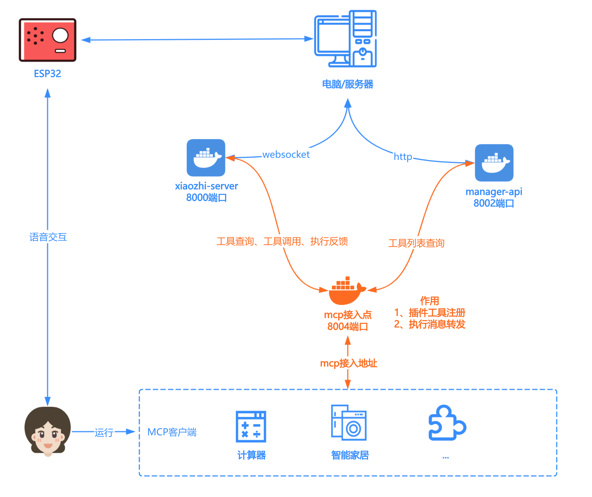

# MCP Endpoint Server

一个高效的xiaozhi mcp接入点服务器，用于[xiaozhi-server](https://github.com/xinnan-tech/xiaozhi-esp32-server)自定义mcp服务注册，方便拓展小智设备工具调用。

本项目是一个基于websocket的MCP注册中心，功能单一，建议使用Docker运行。

## 功能特性

- 🚀 **高性能**: 基于FastAPI和WebSocket的异步架构，支持高并发
- 🔄 **消息转发**: 自动转发工具端和小智端之间的消息
- 🔒 **连接管理**: 智能管理WebSocket连接，支持连接清理
- 📊 **监控统计**: 提供连接统计和健康检查接口
- ⚙️ **配置灵活**: 支持配置文件管理，易于部署和维护
- 🛡️ **错误处理**: 完善的错误处理和日志记录
- 🌐 **多服务器支持**: 支持一个智能体连接多个MCP服务器，统一管理工具列表和调用
- 🎯 **智能路由**: 根据工具名称自动路由到正确的服务器
- 📋 **统一工具列表**: 小智端可以获取所有服务器的工具列表

## 多服务器功能

### 新增特性

- **多MCP服务器连接**: 支持一个智能体连接多个MCP服务器
- **统一工具管理**: 自动收集和更新来自不同服务器的工具列表
- **智能路由**: 根据工具名称自动路由到正确的服务器
- **统一接口**: 为小智端提供统一的工具列表和调用接口
- **工具列表请求**: 小智端可以通过WebSocket请求获取所有可用工具
- **聚合响应**: 支持收集多个服务器的响应并统一返回

### 使用场景

```python
# 一个智能体连接多个MCP服务器
# 智能体: agent_id = "my_agent"
# 服务器1: server_id = "calculator_server" (计算器服务)
# 服务器2: server_id = "weather_server" (天气服务)
# 服务器3: server_id = "translator_server" (翻译服务)

# 小智端可以统一调用所有服务器的工具
tools = [
    {"name": "calculator", "server_id": "calculator_server"},
    {"name": "weather", "server_id": "weather_server"},
    {"name": "translate", "server_id": "translator_server"}
]
```

详细的多服务器功能说明请参考：[多服务器支持文档](./README_multi_server.md)

## 架构设计



## 接入教程

[MCP 接入点部署使用指南](https://github.com/xinnan-tech/xiaozhi-esp32-server/blob/main/docs/mcp-endpoint-integration.md)

## 技术细节
[技术细节](./README_dev.md)

## 快速开始

### 1. 安装依赖

```bash
pip install -r requirements.txt
```

### 2. 配置服务器

编辑 `mcp-endpoint-server.cfg` 文件：

```ini
[server]
host = 0.0.0.0
port = 8004
debug = false
log_level = INFO

[security]
allowed_origins = *
enable_cors = true
```

### 3. 启动服务器

```bash
python main.py
```

### 4. 测试多服务器功能

```bash
python test_multi_server.py
```

## API接口

### 健康检查

```bash
GET /mcp_endpoint/health?key=your_server_key
```

### WebSocket端点

- MCP服务器端: `ws://host:port/mcp_endpoint/mcp/?token=your_token&server_id=your_server_id`
- 小智端: `ws://host:port/mcp_endpoint/call/?token=your_token`

### 工具列表请求

小智端可以通过WebSocket请求工具列表：

```json
{
  "id": 1,
  "jsonrpc": "2.0",
  "method": "tools/list",
  "params": {}
}
```

响应示例：

```json
{
  "jsonrpc": "2.0",
  "result": {
    "tools": [
      {
        "name": "calculator",
        "description": "数学计算器",
        "server_id": "calculator_server"
      },
      {
        "name": "weather",
        "description": "天气查询",
        "server_id": "weather_server"
      }
    ]
  },
  "id": 1
}
```

### 工具调用请求

小智端可以通过WebSocket调用工具：

```json
{
  "id": 10,
  "jsonrpc": "2.0",
  "method": "tools/call",
  "params": {
    "name": "calculator",
    "arguments": {
      "expression": "2 + 3 * 4"
    }
  }
}
```

系统会自动将请求路由到对应的MCP服务器。

## 部署

### Docker部署

```bash
docker-compose up -d
```

### 直接部署

```bash
python main.py
```

## 监控

访问健康检查接口查看服务器状态：

```bash
curl "http://localhost:8004/mcp_endpoint/health?key=your_server_key"
```

响应包含多服务器统计信息：

```json
{
  "jsonrpc": "2.0",
  "result": {
    "status": "success",
    "connections": {
      "mcp_server_connections": 3,
      "robot_connections": 1,
      "total_connections": 4,
      "multi_server_support": true,
      "available_agents": ["my_agent"],
      "total_tools": 6,
      "mcp_servers": {
        "my_agent": {
          "calculator_server": {
            "tools_count": 2,
            "tools": ["calculator", "scientific_calculator"]
          },
          "weather_server": {
            "tools_count": 1,
            "tools": ["weather"]
          }
        }
      }
    }
  },
  "id": null
}
```

## 贡献

欢迎提交Issue和Pull Request！

## 许可证

MIT License
